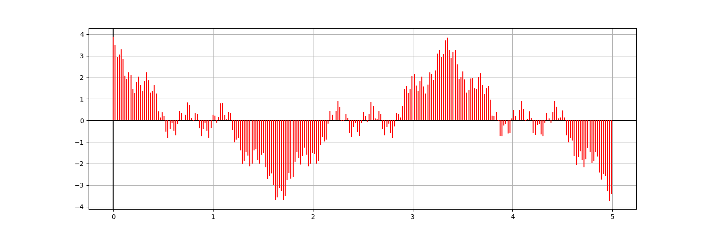
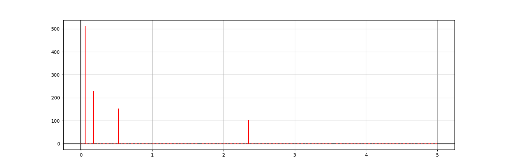

# fft
### Класс, реализующий быстрое преобразование фурье для длинны преобразования кратной 2, 3, 5.

В функцию `fft()`, определенную в классе `FFT`,
```c++
typedef std::complex<double> complex;
static void FFT::fft(std::vector<complex> &in, bool inverse=false);
```
передается входная последовательность.
Для прямого преобразования `inverse = false`, для обратного `inverse = true`. Длина последовательности должна быть составным числом, кратным только 2, 3, 5.

В качестве примера работы в функции main файла `main.cpp` представлено прямое и обратное fft над последовательностью, представляющей сумму четырех косинусов.
```c++
// длина последовательности 2^9 = 512
int n = (int) std::pow(2, 9);
// генерируем n отсчетов, представляющих сумму 4 cos с минимальной частотой f=0.3
std::vector<complex> seq = test::get_cos(n, 0.3, 10.0 / n);
test::print_complex(seq); // перед преобразованием
FFT::fft(seq, false); // forward fft
test::print_complex(seq); // после прямого
FFT::fft(seq, true); // backward fft
test::print_complex(seq); // после обратного
```
Визуализация данных после обратного fft(равна последовательности до прямого fft)

Визуализация данных после прямого fft

